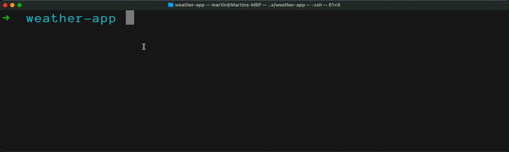

# Weather CLI App

<a href="https://github.com/FernandoTorresL/weather-app/commits/main" target="_blank"></a>

<a href="https://github.com/FernandoTorresL/weather-app" target="_blank"></a>

> See the world's weather 🌤 at home through your CLI window.

View weather and temperature information for different cities around the world right inside your CLI:



Follow the tutorial to [Build This Weather CLI App with Python](https://realpython.com/build-a-python-weather-app-cli/) using only modules from Python's standard library.

## Requirements

To run this CLI app, you need a modern installation of [Python](https://www.python.org/) >= 3.6.

**Note:** This app was developed on macOS for the [Zsh](https://www.zsh.org) shell. Your mileage with some of the color display and emojis may vary depending on your setup. On Windows, [PowerShell](https://docs.microsoft.com/en-us/powershell/) on [Windows Terminal](https://github.com/microsoft/terminal) displays the formatting reasonably well.

You also need an [API key for OpenWeather's API](https://openweathermap.org/appid). After signing up and generating your API key, add it to the `secrets.ini` config file:

```
[openweathermap]
api_key = <YOUR-OPENWEATHERAPP-API-KEY>
```

**Note:** Make sure that `secrets.ini` is not tracked by your version control system, to avoid leaking your API key to the public.

For more information on the OpenWeather API used in this CLI app, check out the [documentation on the city name endpoint](https://openweathermap.org/current#name).

## Usage example

Once you're set up, you can call the weather CLI by running:

```bash
$ python weather.py <CITY_NAME> [-i]
```
---
> If using python3 try with:
```bash
$ python3 weather.py <CITY_NAME> [-i]
```
---
For example, to get the current weather in Vienna, Austria, you can run the following command:

```bash
$ python weather.py Vienna
```

To display the temperature in Fahrenheit, you can add the optional `-i` or `--imperial` flag.

_For more examples and usage, please refer to the [associated Real Python tutorial](https://realpython.com/build-a-python-weather-app-cli/)._

## Development setup

To run and continue development on this CLI project, you need to have **Python>=3.6** installed on your system.

## Release History (this repo)

- WIP

## Meta (Original source)

Martin Breuss – [@martinbreuss](https://twitter.com/martinbreuss) – martin@realpython.com

Distributed under the [MIT License](https://opensource.org/licenses/MIT).

[https://github.com/martin-martin](https://github.com/martin-martin/)

## Contributing to the original project on RealPython repo

1. Fork it (<https://github.com/realpython/materials/fork>)
2. Create your feature branch (`git checkout -b feature/fooBar`)
3. Commit your changes (`git commit -am 'Add some fooBar'`)
4. Push to the branch (`git push origin feature/fooBar`)
5. Create a new Pull Request

## Contributing to this repo

1. Fork it (<https://github.com/FernandoTorresL/weather-app/fork>)
2. Create your feature branch (`git checkout -b feature/fooBar`)
3. Commit your changes (`git commit -am 'Add some fooBar'`)
4. Push to the branch (`git push origin feature/fooBar`)
5. Create a new Pull Request

---

<div align="center">
    <a href="https://fertorresmx.dev/">
      
  </a>
</div>

## Follow me 
[fertorresmx.dev](https://fertorresmx.dev/)

### :globe_with_meridians: [Twitter](https://twitter.com/FerTorresMx), [Instagram](https://www.instagram.com/fertorresmx/): @fertorresmx
